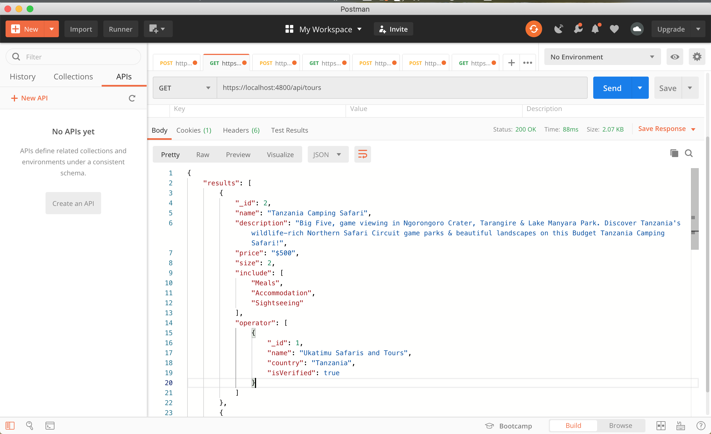

List of RestAPI endpoint
========================

Test API
------------------
You can use any preferred API client to test. Postman was used during development

1. GET
   ```bash
    /api/user/id
    /api/operators 
    /api/operators/id
    /api/tours
    /api/tours/id
   ```
   
2. POST
   ```bash
   /api/operators
   body: {
    "name": "OperatorModel name",
    "country": "Country",
    "isVerified": false
   }
   ```
   
   ```bash
      /api/operators
      body: {
       "name": "Example Camping TourModel",
       "description": "Example tour....",
       "price": "$500",
       "size": 2,
       "include": [
         "Meals",
         "Accommodation",
         "Sightseeing"
       ]
      }
      ```
   
      ```bash
      /api/booking
      body: {
        "tourId": 1,
        "email": "user1@user.com",
        "from": "2020-09-20",
        "to": "2020-09-24",
        "comment": "comment"
      }
      ```
   
      ```bash
       /api/booking
       body:{
         "name": "testingUser1",
         "email": "testingUse1rw@gmail.com",
         "password": "User123$%^",
         "age": 12
       }
      ```   

### Postman
-----------

